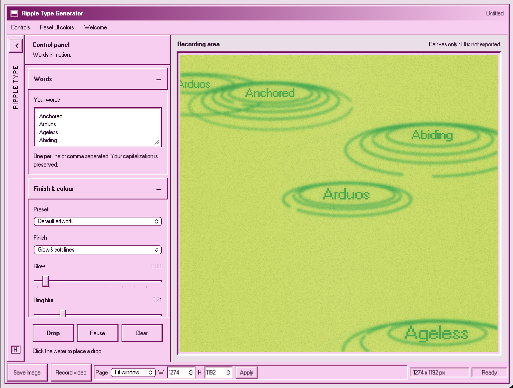

# Ripple Type Generator

**Designed and Coded by Eemon Roy.**

A browser-based kinetic typography tool: falling droplets become words and leave
expanding, interacting rings. A pink, Windows 98-inspired interface surrounds the
artwork; only the framed canvas is exported.

Built with plain HTML, CSS and JavaScript using Canvas 2D. No build step, package
installation, backend, API keys, account system or database is required.



## Run locally

From the repository root:

```sh
python3 -m http.server 8777 --bind 127.0.0.1
```

Open **http://127.0.0.1:8777/**. Refresh after editing files.

The app also supports opening `index.html` directly for basic use. A local HTTP
server is recommended for consistent font/download behavior and is required for
the browser checks.

Use a current Chrome, Edge, Firefox or Safari. Video encoding and download support
vary by browser; Chrome or Edge is a useful alternative if recording is unavailable.

## Create an artwork

1. Enter words, one per line or comma-separated. Capitalization is preserved.
2. Click inside the canvas to place a droplet, or let the automatic drops run.
3. Adjust the controls in the left rail. Collapse the rail to give the preview more room.
4. Set a page size in the bottom bar, then use **Save image** or **Record video**.

| Section | Controls |
| --- | --- |
| Words | Text cycled through the droplets |
| Finish & colour | Presets, glow/soft lines or diffused ink, blur, grain, water and ink colors |
| Rings | Line weight, ring count, spread, stable breaks and interference |
| Typography | Font, size, letter spacing/kerning, tilt, independent text glow and blur |
| Motion & camera | Drop interval, fall speed, ripple speed, surface tilt and perspective bow |
| UI palette | Interface and bevel colors; these never affect the exported image |

**Default artwork** restores the approved green artwork, Windows bitmap type and
creative settings. It preserves the words `Anchored`, `Arduos`, `Ageless`, `Abiding`
exactly as entered. **Cobalt paper** provides the grainy, diffused blue-ink finish.
Other color presets remain available.

**Keep words sharp** disables text blur, not text glow. Kerning adjusts uniform
letter spacing relative to the selected font's tracking. Some display fonts, such
as Bebas Neue, have all-capital glyph designs.

| Key | Action |
| --- | --- |
| `H` | Expand/collapse the rail |
| `Escape` | Close the welcome window or collapse the rail |
| `D` | Add a drop |
| `C` | Clear the canvas |
| `Space` | Pause/play |

Shortcuts do not intercept typing in controls. The welcome window can be reopened
from the menu and is disabled during recording.

## Page size and exports

Choose **Fit window** for a responsive canvas, or a fixed-size preset:

| Preset | Export size |
| --- | --- |
| 16:9 | 1920 x 1080 |
| 9:16 | 1080 x 1920 |
| 4:4 | 1080 x 1080 |
| 18:9 | 2160 x 1080 |

For a custom size, enter W and H and press **Apply**. Each dimension can be
64–4096 pixels. Fixed sizes are exact export dimensions, independent of screen DPI.
The preview scales proportionally to fit the workspace.

- **Save image:** downloads a PNG of the current canvas.
- **Record video:** starts a silent canvas recording. Press it again to stop and
  download the video. The browser selects WebM or MP4.
- The interface, frame and welcome window are never included.
- Recording locks the canvas resolution. Resizing the window changes only the preview.
- Keep the recording tab visible. Browsers suspend or throttle hidden-tab animation.
- Large canvases, many simultaneous rings and long recordings use more CPU and memory.
  Video chunks stay in browser memory until the recording is saved.

## Publish to GitHub

Upload or push this repository to your GitHub repository. Keep this structure at
the repository root:

```text
index.html
styles.css
js/
assets/fonts/
_headers
README.md
tests/
```

Do not place everything inside an extra enclosing folder unless you also set that
folder as the Cloudflare root directory. Keep all font licenses and attribution
files in `assets/fonts/`.

If the project is already a Git repository, use its existing configuration rather
than running `git init` again or overwriting its remote. No secrets or environment
variables need to be uploaded. `.gitignore` excludes common local files and credentials.

## Deploy on Cloudflare

This repository supports both Cloudflare deployment styles:

| Goal | Cloudflare product | Result |
| --- | --- | --- |
| Fastest public link | Pages | `https://<project>.pages.dev` |
| This exact path | Workers Static Assets + route | `https://eemonroy.com/rippletypegenerator/` |
| A separate branded address | Pages custom domain | For example, `https://rippletypegenerator.eemonroy.com` |

### Option A: Cloudflare Pages

Use this when a `pages.dev` URL or subdomain is enough:

1. In Cloudflare, open **Workers & Pages → Create application → Pages**.
2. Choose **Import an existing Git repository** and connect `EemonWorks/ripple-type-generator`.
3. Configure:

| Setting | Value |
| --- | --- |
| Production branch | `main` |
| Framework preset | None |
| Build command | `exit 0` |
| Build output directory | `.` |
| Root directory | Leave blank |
| Environment variables | None |

4. Deploy. Cloudflare provides a `*.pages.dev` URL. A Pages custom domain can then
   use a subdomain such as `rippletypegenerator.eemonroy.com`.

### Option B: `eemonroy.com/rippletypegenerator/`

Pages custom domains do not mount a project below a path on an existing site. The
repository therefore includes `wrangler.jsonc` and `src/worker.js` for the requested
path. The Worker does two things:

- redirects `/rippletypegenerator` to `/rippletypegenerator/`, so the app's relative
  CSS, JavaScript and font URLs resolve correctly;
- removes the `/rippletypegenerator` prefix before asking Cloudflare Static Assets for
  `index.html`, `js/*`, `styles.css` and `assets/*`.

The trailing slash is intentional; the no-slash URL redirects automatically.

#### One-time Cloudflare setup

You must do these account and domain steps:

1. Add `eemonroy.com` to the Cloudflare account if it is not already there.
2. If Cloudflare asks for it, update the domain's nameservers at the registrar.
3. Make sure the domain has an active, proxied DNS record. Cloudflare routes require
   an active zone and a proxied hostname.
4. Make sure no existing Worker route already owns
   `eemonroy.com/rippletypegenerator*`.

#### Deploy from your Mac

From the project root:

```sh
npx wrangler login
npx wrangler deploy
```

Wrangler reads `wrangler.jsonc`, uploads the static files, and creates the route
`eemonroy.com/rippletypegenerator*`. It does not need a build step or environment
variables. The first login and Cloudflare account authorization must be completed by
you.

#### Deploy from GitHub

Cloudflare can also connect the GitHub repository through Workers Builds. Choose
`EemonWorks/ripple-type-generator`, branch `main`, and use:

| Setting | Value |
| --- | --- |
| Build command | `npx wrangler deploy` |
| Root directory | `/` |
| Environment variables | None |

Authorize the Cloudflare account to deploy the Worker and manage the
`eemonroy.com` route. Each push to `main` then redeploys the app.

The root `_headers` file is retained for Pages deployments. Workers Static Assets
handles caching of uploaded assets automatically.

Official references:
[Cloudflare Pages static HTML](https://developers.cloudflare.com/pages/framework-guides/deploy-anything/) ·
[Workers Static Assets](https://developers.cloudflare.com/workers/static-assets/) ·
[Worker routes](https://developers.cloudflare.com/workers/configuration/routing/routes/).

## Development

The app uses classic script tags and a small `window.RTG` namespace. Script order
in `index.html` matters; no bundler or module loader is involved.

| File | Responsibility |
| --- | --- |
| `js/controls.js` | Approved defaults, presets, UI palette and control bindings |
| `js/main.js` | Scheduling, resize handling, click placement and export actions |
| `js/camera.js` | Stylized local perspective |
| `js/ripple.js` | Ripple lifetimes, text layout and optional font loading |
| `js/field.js` | Wavelet field for stylized ring interactions |
| `js/droplet.js` | Falling droplets and strobe trails |
| `js/render.js` | Canvas layers, ring geometry, glow and text composition |
| `js/blur.js` | Reusable alpha-mask blur, independent of canvas-filter support |
| `js/grain.js` | Grain tile, animated or stationary |
| `js/export.js` | PNG/video downloads and recording resource cleanup |

Edit `DEFAULT_ARTWORK` in `js/controls.js` to change launch settings and the
**Default artwork** preset. Controls initialize from those values. `UI_COLORS`
holds the palette defaults; CSS variables provide the initial page styling.
Range limits and labels are in `index.html`.

Rendering runs continuously only during animation or recording. A paused canvas
redraws when its settings change, and hidden tabs stop scheduling frames. Blurred
layers use smaller read-friendly source canvases; sharp text remains at export
resolution. Ring interactions are a visual effect, not a full fluid simulation.

### Checks

With the local server running, open:

**http://127.0.0.1:8777/tests/rendering.html**

The dependency-free browser checks exercise real canvas pixels, saved defaults,
blur/glow, word case, kerning, theme isolation, welcome/keyboard behavior, recording
sizes and PNG round trips.

If Node.js is available, syntax can also be checked without installing packages:

```sh
for file in js/*.js tests/*.js; do
  node --check "$file" || exit 1
done
```

## Fonts, privacy and attribution

The default Windows-style fonts are bundled locally. Optional typefaces load from
Google Fonts only when selected; those requests contact Google. If a web font cannot
load, the UI reports the fallback. The app itself has no analytics and does not upload
your words, images or recordings.

MS Sans Serif and MS Sans Serif Bold are by **lou**, under **CC BY-SA 3.0**.
WOFF2 conversions come from **98.css**. Original fonts, licenses, readmes and
conversion attribution are retained in `assets/fonts/ms-sans-serif/`.
Those licenses cover their respective font assets; no separate application-code
license has been selected in this repository.
