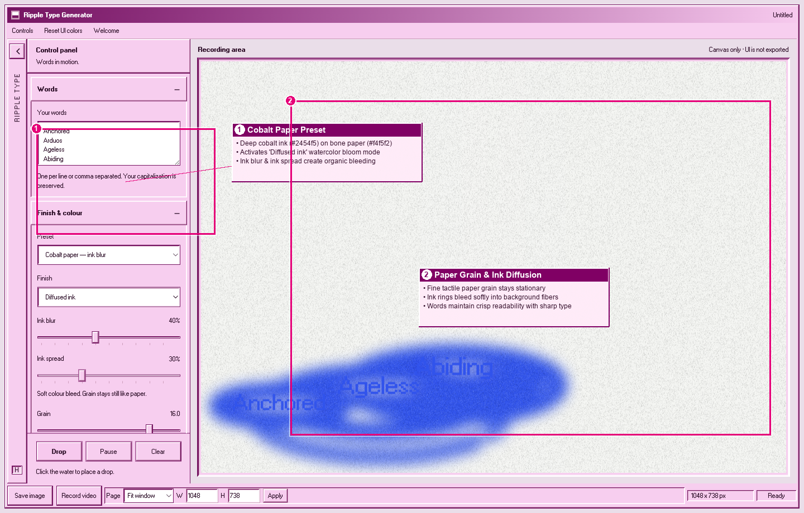

# 🌊 Ripple Type Generator: Complete Visual Tutorial & Guide

Welcome to the **Ripple Type Generator** tutorial! This guide walks you through every control, parameter, effect, and workflow in the app — from crafting fluid typography with interactive water ripples to exporting high-resolution video clips, animated GIFs, and posters.

---

## 🎬 Live Motion Demo

Below is a demonstration of the generator in action — showing real-time word animation, interactive canvas click ripples, organic ring break adjustments, typography tilt, color preset switches, and vertical aspect ratios:


*(High-definition MP4 and WebM video captures are also available in `tutorial/video/ripple-type-generator-demo.mp4` and `tutorial/video/ripple-type-generator-demo.webm`)*

---

## 🗺️ Interface Overview & Annotated Map

The interface combines a nostalgic **Windows 98 retro aesthetic** with a modern GPU-accelerated canvas engine.

### 1. Workspace Layout


1. **Title Bar & Window Controls**: Contains retro minimize/maximize/close icons, quick audio toggle, and app branding.
2. **Left Control Rail**: Houses all collapsible setting groups: Words, Finishes, Rings, Typography, Motion, UI Palette, and Export Tools.
3. **Interactive Kinetic Canvas**: Renders real-time ripples, typography, and optical diffusion shaders. Clicking anywhere on the canvas drops an instant water droplet.
4. **Bottom Status Bar**: Displays live FPS telemetry, active drop counter, canvas dimensions, resolution multiplier, and one-click quick action buttons (Preset, Pause, Aspect Ratio, Screenshot).

---

## 🎛️ Detailed Control Reference


### 📝 Words & Fall Sequences
* **Words Input (`words`)**: Comma-separated or newline-separated list of words (e.g., `ANCHORED, ARDUOUS, AGELESS, ABIDING`). The engine continuously drops water ripples in this sequence.
* **Fall Speed (`fallSpeed`)**: Controls the descent velocity of words entering the fluid field.
* **Drop Rate (`dropRate`)**: Frequency of new words spawning onto the canvas.

### ✨ Finishes & Diffusion Shading
* **Finish Preset Selector (`finish`)**: Choose between optical surface styles:
  * `Glow`: High-energy neon luminescence with soft bloom.
  * `Paper`: Matted tactile paper grain with organic edge diffusion.
  * `Bleed`: Heavy ink diffusion simulating wet watercolor or risograph bleed.
  * `Ghost`: Ethereal semi-transparent trail echoes.
* **Line Weight (`lineWeight`)**: Stroke thickness of the concentric water ripple rings.
* **Ripple Glow (`glow`)**: Luminance intensity of the expanding wavefronts.
* **Soften / Blur (`soften`)**: Multi-pass box blur smoothing that creates organic fluid cohesion.
* **Film Grain (`grain`)**: Analog tactile noise added to paper and background textures.
* **Sharp Type (`sharpType`)**: When enabled, keeps letterforms razor-sharp while allowing the outer ripple rings to diffuse organically.

---

### ⭕ Organic Rings & Breaking Geometry
* **Ring Breaks (`ringBreaks`)**: Introduces natural randomized breaks and gaps along the circumference of the concentric circles to break mechanical rigidity into organic water rings.
* **Ring Speed (`rippleSpeed`)**: Propagation speed of the expanding shockwaves.
* **Fade Duration (`rippleDecay`)**: Lifespan and dissipation rate of expanding waves.

---

### 🔤 Typography & Angles


* **Font Selector (`font`)**: Choose between retro monospace (`Win98 System`), bold geometric sans (`Inter`, `Syne`), expressive serifs (`Playfair`), or cyber display fonts.
* **Type Size (`typeSize`)**: Scale multiplier for the rendered typographic glyphs.
* **Type Tilt (`typeTilt`)**: Isometric perspective slant angle applied directly to the letterforms.
* **Global Canvas Tilt (`tilt`)**: Global angular rotation of the ripple field.
* **Kerning (`kerning`)**: Letter-spacing adjustments for tight or loose typography.

---

### 🎵 Music & Interactive Droplets
* **Interactive Canvas Clicks**: Click or tap anywhere on the canvas surface to immediately spawn an interactive ripple droplet at that exact coordinate.
* **YouTube / Audio Sync Mode**: Toggle the audio mode to play music or YouTube tracks with captions — falling droplets react to lyric timing and audio amplitude.

---

## 🎨 Color Presets & Themes



The generator includes curated color and optical presets:
* **Chartreuse Glow (Default)**: `#c5dc4d` vibrant lime background with `#00a943` forest ink.
* **Cobalt Paper Diffusion**: `#889ae3` periwinkle background with `#0017a9` rich cobalt ink and heavy paper texture.
* **Toxic Cyber Neon**: `#000000` pitch black canvas with `#00ff66` neon radioactive ink.
* **Noir Risograph**: `#ffffff` clean paper with `#0a0a0a` deep carbon black ink.
* **Sunset Dream**: `#ff5e62` warm coral background with `#3a0066` twilight purple ink.

---

## 📐 Aspect Ratios & Frame Modes


Switch canvas dimensions instantly for any delivery channel:
* **16:9 Landscape**: Desktop banners, video backgrounds, presentations.
* **9:16 Vertical**: Instagram Stories, TikTok, YouTube Shorts, mobile wallpapers.
* **1:1 Square**: Instagram posts, album artwork, avatar art.
* **Fill / Responsive**: Dynamically expands to fill your browser window.

---

## 💾 Export Options & Deliverables


* **📸 Export PNG (High-Res)**: Captures pixel-perfect raster stills up to 4K resolution (`1x`, `2x`, `4x` scale multipliers).
* **🎥 Export WebM / MP4 Video**: Records seamless 60fps canvas animations directly in the browser using the MediaRecorder API.
* **🎞️ Export Animated GIF**: Generates optimized looping GIFs for easy sharing on social media.
* **📐 Export Vector SVG**: Exports clean vector contour paths of the current frame for print and plotter workflows.

---

## ⌨️ Keyboard Shortcuts Reference

| Key | Action |
| :--- | :--- |
| **`Space`** | Play / Pause kinetic animation |
| **`R`** | Cycle to next Color / Diffusion Preset |
| **`C`** | Clear active ripples on canvas |
| **`S`** | Quick Save PNG screenshot |
| **`H`** | Hide / Show Control Rail (Presentation mode) |
| **`Click / Tap`** | Spawn manual water droplet at cursor position |

---

## 📂 File Directory

All tutorial assets, captures, and videos are saved in the project repository:
```
tutorial/
├── index.html                               # Interactive HTML tutorial viewer
├── TUTORIAL.md                              # This complete markdown guide
├── screenshots/
│   ├── 01-welcome-dialog.png                # Welcome dialog & quick start
│   ├── 02-full-workspace.png                # Unannotated full workspace
│   ├── 02-full-workspace-annotated.png      # Annotated workspace breakdown
│   ├── 03-control-rail-all-open.png         # Full control panel capture
│   ├── 03-control-rail-annotated.png        # Annotated parameter controls
│   ├── 04-canvas-workspace.png              # Live kinetic canvas view
│   ├── 04-canvas-workspace-annotated.png    # Annotated canvas interaction points
│   ├── 05-export-statusbar.png              # Status bar & export toolbar
│   ├── 05-export-statusbar-annotated.png    # Annotated export controls
│   ├── 06-preset-cobalt-diffusion.png       # Cobalt paper diffusion preset
│   ├── 06-preset-cobalt-annotated.png       # Annotated preset breakdown
│   ├── 07-preset-typography-tilt.png        # Angled typography preset
│   └── 08-aspect-ratio-9-16.png             # Vertical story 9:16 format
└── video/
    ├── ripple-type-generator-demo.mp4       # 1080p H.264 video demo
    ├── ripple-type-generator-demo.webm      # WebM VP9 video demo
    └── ripple-type-generator-demo.gif       # 60-frame looping animated GIF
```
