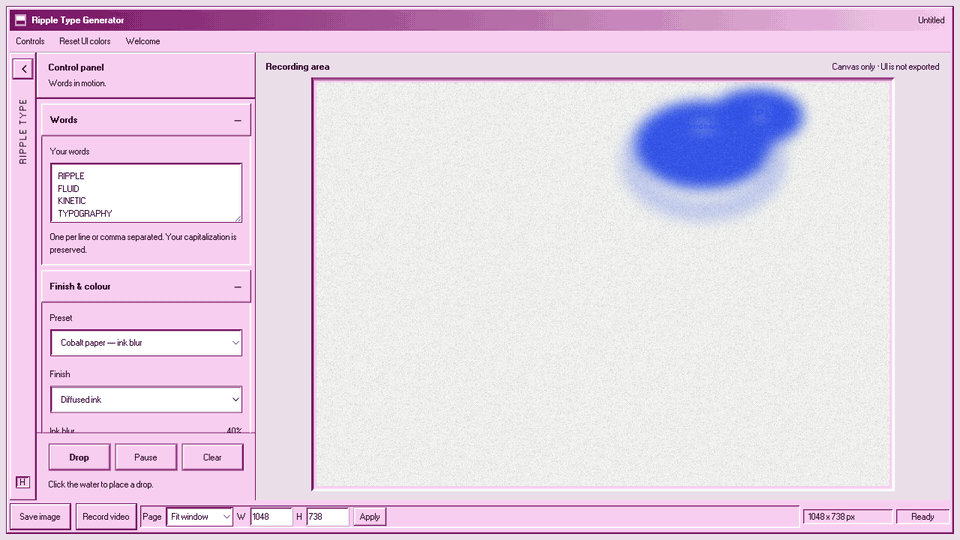
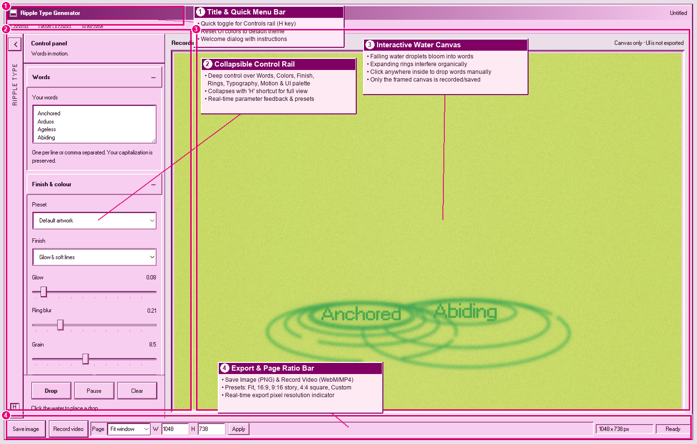
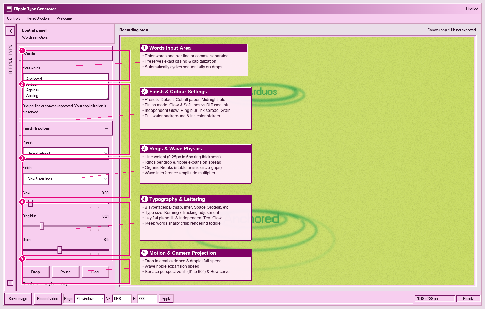
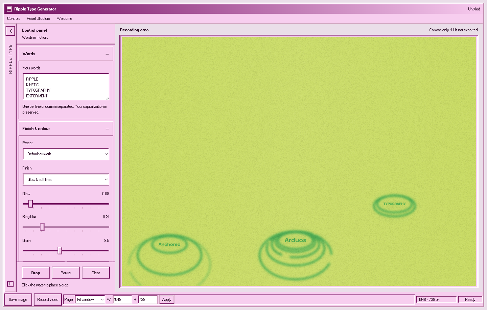
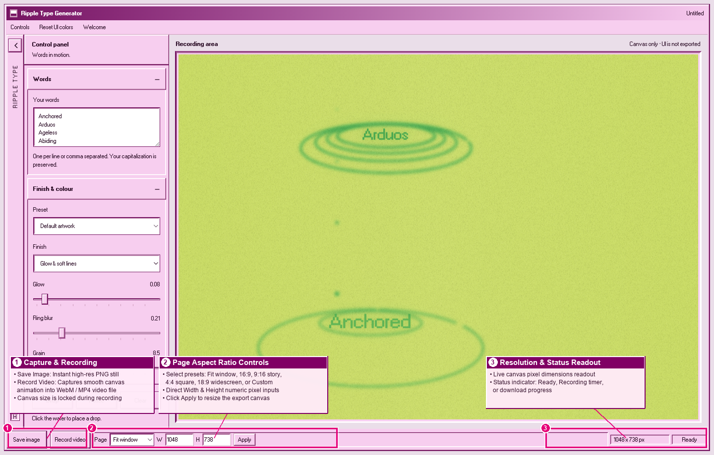
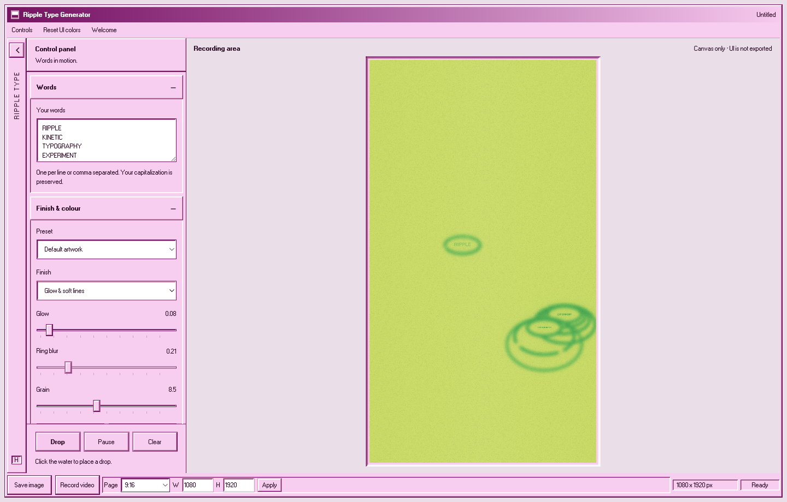

# Ripple Type Generator — Tutorial

Words fall as droplets onto a tilted sheet of water. Where each one lands it leaves a
ring, the ring carries the word, and overlapping rings interfere with each other.
This guide walks through every control in the app.

---

## Demo



The clip above is a real 36-second screen recording, in order:

| Time | What is happening |
| :--- | :--- |
| 0:00 | Words fall on their own and leave ripples |
| 0:04 | Clicking the canvas drops a word exactly where you click |
| 0:08 | **Type size** scales the words down, then up |
| 0:14 | **Lay flat** tips the words onto the water, then stands them straight again |
| 0:20 | **Surface tilt** changes the angle the ripples are seen from |
| 0:26 | **Preset** swaps the background colour — Reference blue, Midnight, Rust, Ink on bone |

Higher quality copies live next to it:
`tutorial/video/ripple-type-generator-demo.mp4` (1280×720, 30fps) and
`ripple-type-generator-demo.webm`.

---

## The window



| Area | What it is |
| :--- | :--- |
| Control rail (left) | Collapsible groups: Words, Finish & colour, Rings, Typography, Motion & camera, UI palette |
| Recording area (right) | The canvas. Only this rectangle is exported — the UI never appears in your file |
| Rail footer | **Drop**, **Pause**, **Clear** |
| Status bar (bottom) | **Save image**, **Record video**, page size, live pixel dimensions, capture status |

The `‹` button at the top of the rail collapses it to a thin spine, so you can see the
artwork full width. Press it again — or `H` — to bring the controls back.

---

## Words



One word per line, or comma separated. Your capitalization is preserved, so
`Anchored` falls as `Anchored`, not `ANCHORED`. The app cycles through the list in
order, and a click on the canvas pulls the next word from the same list.

---

## Finish & colour

**Preset** — the dropdown used in the demo. Seven of them:

| Preset | Water | Ink |
| :--- | :--- | :--- |
| Default artwork | chartreuse `#c5dc4d` | green `#00a943` |
| Reference blue | `#5e9de0` | near-white `#f0f5fd` |
| Cobalt paper — ink blur | `#f4f5f2` | cobalt `#2454f5` (switches to Diffused ink) |
| Midnight | `#0e1930` | pale blue `#7fa9f0` |
| Ink on bone | `#efe7d8` | near-black `#1d1c1a` |
| Acid | `#c9f24a` | dark olive `#152210` |
| Rust | `#bf4f2b` | warm cream `#ffe7d4` |

*Default artwork* also restores every slider, so reach for it when you want to start
over. The other six only change colour and finish, which is why the demo can set up
the type and the tilt first and then flip through backgrounds without losing them.

**Finish** — two rendering models:

- **Glow & soft lines** — luminous rings. Exposes **Glow** and **Ring blur**.
- **Diffused ink** — ink bleeding into paper. Exposes **Ink blur** and **Ink spread**.

**Grain** adds paper noise. **Water** and **Ink** are free colour pickers if none of
the presets are what you want.

---

## Rings

| Control | What it does |
| :--- | :--- |
| Line weight | Thickness of each ring |
| Rings per drop | How many concentric rings one droplet makes (1–9) |
| Ripple spread | How far the rings travel from the impact point |
| Breaks | Cuts small gaps in the circles so they look hand-drawn instead of perfect |
| Interference | How strongly overlapping rings distort each other |

**Breaks** is the organic-shapes control. At `0%` the rings are perfect circles; push
it up and the outlines start to break apart like real disturbed water.

---

## Typography



**Font** — Inter, Windows bitmap (the default), Poppins, Space Grotesk, Bebas Neue,
Anton, IBM Plex Mono, Playfair Display. Everything except Windows bitmap is fetched
from Google Fonts the first time you pick it.

| Control | What it does |
| :--- | :--- |
| Type size | Scales the words. Demo at 0:08 |
| Kerning | Letter spacing, in em |
| Lay flat | `0%` stands the word upright, `100%` lays it flat into the water plane. Demo at 0:14 |
| Text glow | Halo on the letters only, independent of ring glow |
| Keep words sharp | On by default. Keeps letters crisp while the rings stay soft |
| Text blur | Only adjustable once *Keep words sharp* is off |

---

## Motion & camera

| Control | What it does |
| :--- | :--- |
| Drop interval | Seconds between automatic drops. Higher = calmer |
| Fall speed | How fast a droplet falls before impact |
| Ripple speed | How fast rings expand once it lands |
| Surface tilt | The viewing angle of the water, 6°–60°. Demo at 0:20 |
| Perspective bow | How much perspective is applied. Low values flatten it toward a plan view |

**Surface tilt** is the one that changes the angle of the ripples. Low values look
almost edge-on, so rings read as flat ellipses; high values look down at the water and
the rings open up into circles.

---

## Exporting



- **Save image** writes a PNG of the canvas at its current pixel size.
- **Record video** captures the canvas live. It records WebM (VP9, falling back to VP8),
  or MP4 where the browser supports it. Press it again to stop and download.
- **Page** sets the export size: Fit window, 16:9, 9:16, 4:4 (square), 18:9, or Custom
  via the **W** / **H** boxes and **Apply**.

The status bar always shows the true export resolution, and the canvas cannot be
resized while a recording is running.



---

## Keyboard

| Key | Action |
| :--- | :--- |
| `D` | Drop a word now |
| `C` | Clear the water |
| `Space` | Pause / resume |
| `H` | Show or hide the control rail |
| `Esc` | Hide the control rail |
| Click canvas | Drop a word at that exact point |

Shortcuts are ignored while you are typing in a field, so you can use the letters
`d`, `c` and `h` inside the Words box normally.

---

## A quick recipe

1. Type four words into **Words**.
2. Pick **Midnight** from **Preset**.
3. Set **Lay flat** to about `20%` and **Surface tilt** to about `25°`.
4. Raise **Breaks** to roughly `40%` so the rings stop looking mechanical.
5. Set **Page** to `9:16`, press **Apply**.
6. Press **Record video**, let it run, press it again to save.

---

## Files

```
TUTORIAL.md                                  this guide
tutorial/index.html                          the same guide as a local viewer
tutorial/screenshots/
  01-welcome-dialog.png                      the opening window
  02-full-workspace.png / -annotated.png     window layout
  03-control-rail-all-open.png / -annotated  every control group
  04-canvas-workspace.png / -annotated.png   the canvas and click drops
  05-export-statusbar.png / -annotated.png   export controls
  06-preset-cobalt-diffusion.png / -annotated  Diffused ink finish
  07-preset-typography-tilt.png              angled type
  08-aspect-ratio-9-16.png                   vertical page size
tutorial/video/
  ripple-type-generator-demo.mp4             1280x720, 30fps, 36s
  ripple-type-generator-demo.webm            same, VP9
  ripple-type-generator-demo.gif             600px, looping
```

Open `tutorial/index.html` in a browser to read this with the video embedded and the
screenshots zoomable.
